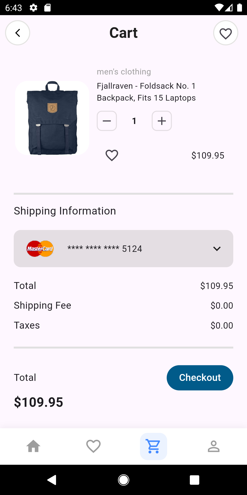

# Mini E-Commerce Flutter App

A Flutter e-commerce app that demonstrates product listing, shopping cart.

## Setup Instructions

**1.Clone the repository:**

git clone https://github.com/yasminamo/mini_ecommerce_app.git

**2.Navigate to the project folder:**

cd mini_ecommerce_app

**3.Install dependencies:**

flutter pub get

**4.Run the app:**

flutter run

## API Endpoints Used

Getallcategories: https://fakestoreapi.com/products/categories

Get all products: https://fakestoreapi.com/products

## Folder Structure

lib/

 ├── Models/        # Data models (e.g., CartModel)

 ├── Services/      # API calls 

 ├── Providers/     # State management classes

 ├── Screens/       # UI screens

 ├── Widgets/       # Reusable widgets (CustomCard, AppBar, etc.)

 └── main.dart      # App entry point 

## State Management

The app uses **Provider** for state management. 

Why Provider?

Because:

1-Lightweight and simple to integrate with Flutter.

2-Efficient for apps with small to medium state complexity.

3-UI updates automatically when state changes.

## Screenshots

